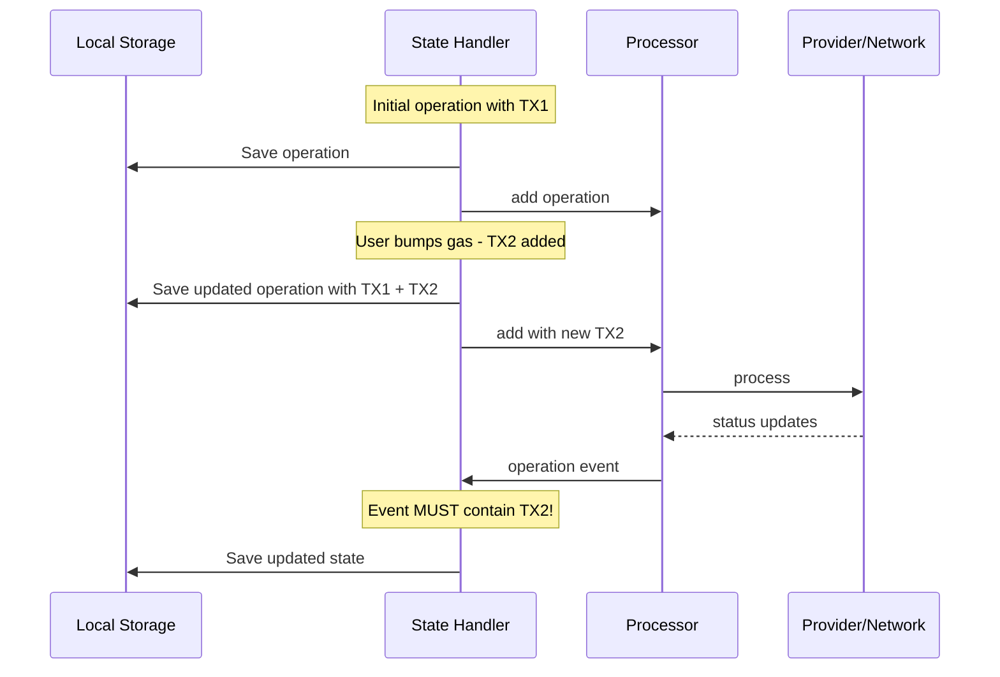
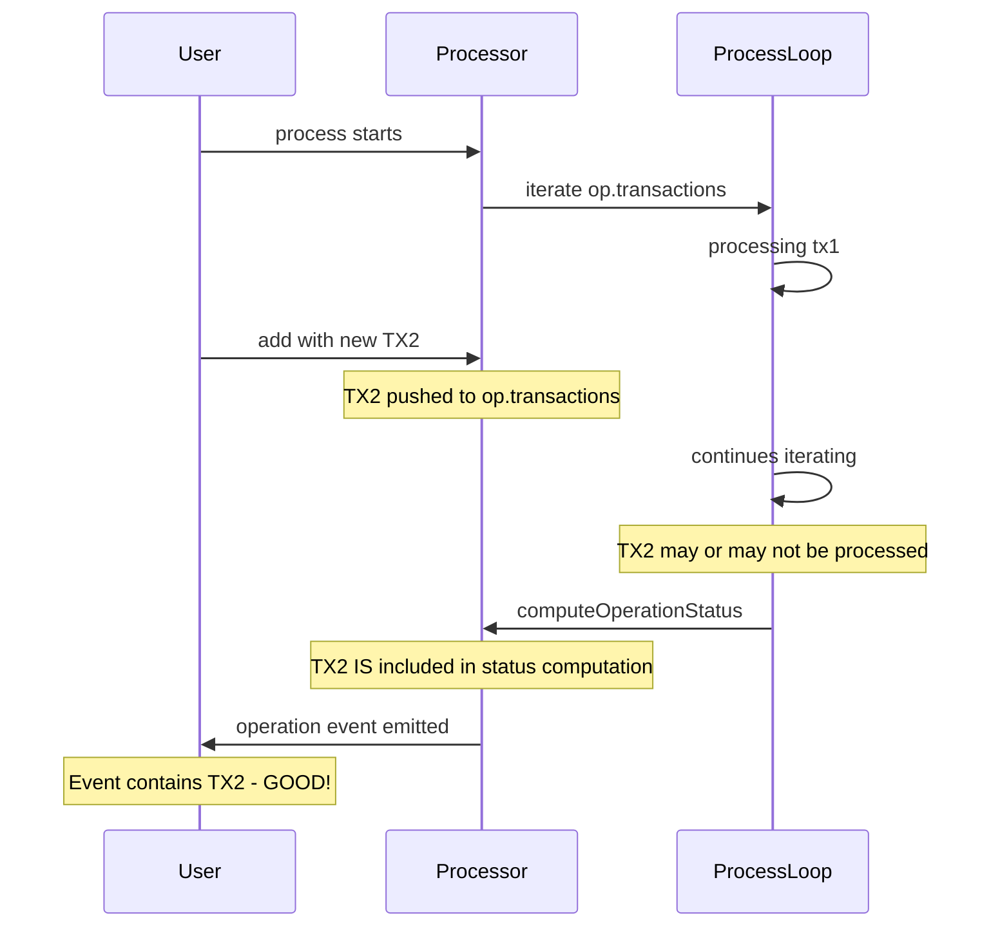
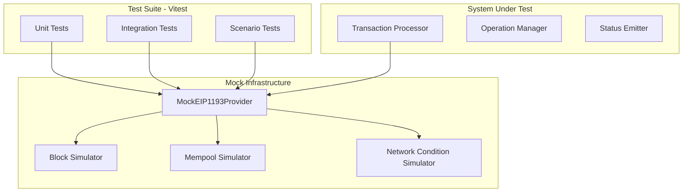
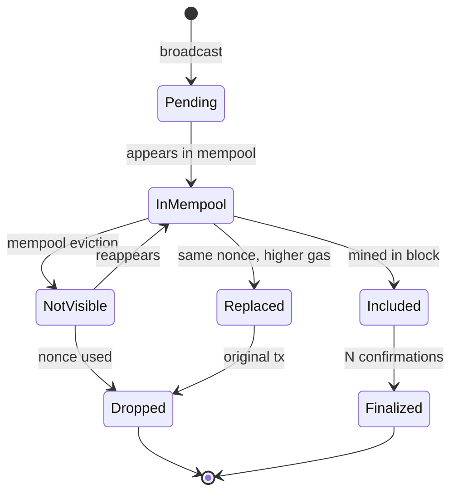
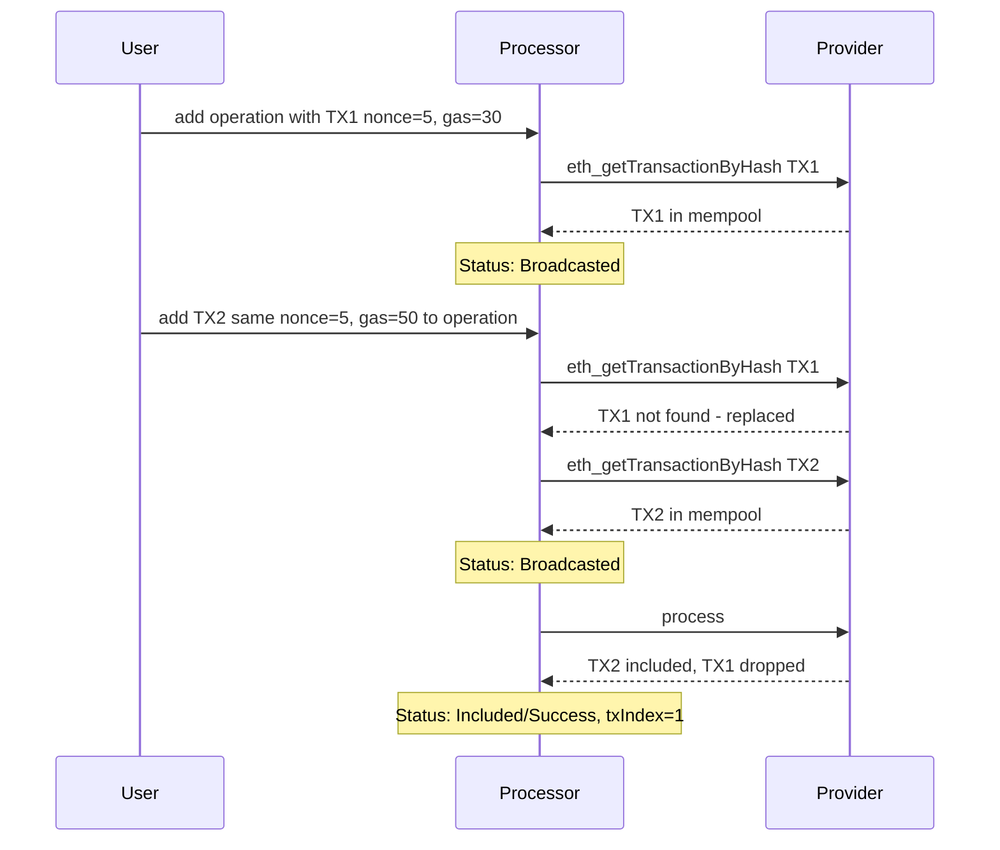
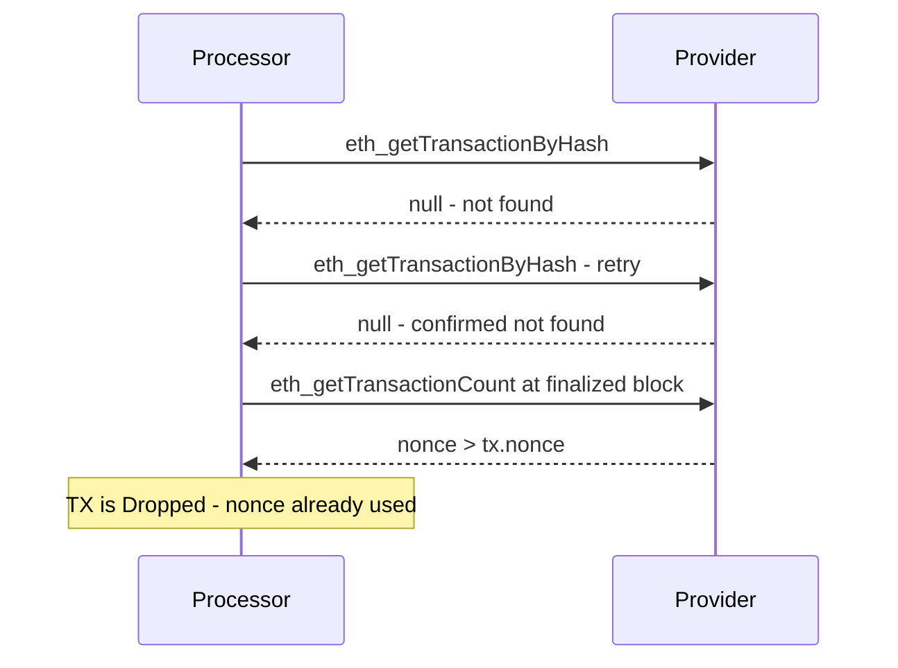

# Ethereum TX Observer - Comprehensive Testing Plan

## Overview

This plan outlines a thorough testing strategy for the `ethereum-tx-observer` transaction processor, focusing on:
- **Transaction replacement scenarios** (gas bumping)
- **Dropped transaction scenarios**
- **Simulated network conditions**
- **Consistency with local state handler** (add during process)

## Critical Requirement: Consistency with Local State Handler

### Use Case

The processor is used alongside a local-state handler that:
1. **Saves operations to disk immediately** to avoid data loss
2. Calls `processor.add(operations)` to start/update tracking
3. **Listens for `operation` events** to save updated state



### Consistency Guarantee Required

**After `add()` returns, any subsequent `operation` event MUST include the newly added transaction.**

This ensures:
- Local disk state and processor state stay in sync
- No transactions are "lost" during event handling
- State handler can safely overwrite local state with event data

### Race Condition Analysis

The current code has a potential issue when `add()` is called during `process()`:



**Good news**: Looking at the current code, the consistency guarantee IS met:
1. `add()` immediately pushes to `op.transactions`
2. `computeOperationStatus()` reads from `op.transactions` at emission time
3. The emitted operation object contains all transactions

**But there's a subtle issue**: The new TX may not have been processed yet, so its status remains at the initial value the user set. This could affect the merged operation status.

### Recommended: Snapshot Iteration with Recompute

```typescript
async function processOperation(op: OnchainOperation, ...) {
  // Snapshot transactions to avoid mid-iteration modifications
  const txsSnapshot = [...op.transactions];
  
  for (const tx of txsSnapshot) {
    await processTx(tx, ...);
  }
  
  // IMPORTANT: Compute status from ALL current txs, not just snapshot
  // This ensures txs added during processing are included in status
  const newStatus = computeOperationStatus(op); // Uses op.transactions, not snapshot
  
  // New txs added during processing will be fully processed in next cycle,
  // but they ARE included in the current event emission
}
```

### Key Guarantees to Test

| Guarantee | Description |
|-----------|-------------|
| **Event Completeness** | Any tx added before event emission IS in the emitted operation |
| **Status Accuracy** | Operation status reflects ALL transactions |
| **No Data Loss** | State handler can safely overwrite local state with event data |

## Architecture

### Test Infrastructure



### MockEIP1193Provider Design

The mock provider will simulate:
- Block progression
- Mempool state
- Transaction receipts
- Network failures
- Latency



## Test Categories

### 1. Single Transaction Lifecycle Tests

| Test Case | Initial State | Action | Expected Result |
|-----------|---------------|--------|-----------------|
| Broadcast to inclusion | BeingFetched | Process with tx in block | Included/Success |
| Broadcast to failure | BeingFetched | Process with failed receipt | Included/Failure |
| Mempool visibility | BeingFetched | Process with tx in mempool | Broadcasted |
| Mempool disappearance | Broadcasted | Process with tx gone | NotFound |
| Nonce consumed | NotFound | Process with nonce passed | Dropped |
| Finality reached | Included | Process after N blocks | final timestamp set |

### 2. Transaction Replacement Scenarios - Priority Focus

These tests cover gas bumping where multiple transactions share the same nonce.

#### 2.1 Basic Replacement



| Test Case | Description | Expected Behavior |
|-----------|-------------|-------------------|
| `replacement-basic-success` | TX1 replaced by TX2 with higher gas, TX2 succeeds | Operation: Included/Success, txIndex points to TX2 |
| `replacement-original-wins` | TX1 with lower gas gets included first | Operation: Included/Success, txIndex points to TX1, TX2 becomes Dropped |
| `replacement-both-broadcast` | Both TX1 and TX2 visible in mempool briefly | Operation: Broadcasted until one is included |
| `replacement-failure-fallback` | TX2 replaces TX1, but TX2 fails | Operation: Included/Failure, txIndex points to TX2 |
| `replacement-chain-of-three` | TX1 → TX2 → TX3 progressive gas bumping | Operation tracks all, final status from winning tx |

#### 2.2 Race Conditions in Replacement

| Test Case | Description | Expected Behavior |
|-----------|-------------|-------------------|
| `replacement-race-both-included` | Edge case: both txs briefly appear included during reorg | Merge logic picks first success |
| `replacement-simultaneous-update` | Both txs change status in same process call | Correct merged status |
| `replacement-flapping` | TX appears/disappears from mempool intermittently | Status settles correctly |

### 3. Dropped Transaction Scenarios - Priority Focus

Tests for transactions that are dropped from the mempool and cannot be included.

#### 3.1 Drop Detection



| Test Case | Description | Expected Behavior |
|-----------|-------------|-------------------|
| `dropped-nonce-consumed` | Tx nonce is less than account nonce at finalized block | Status: Dropped with final timestamp |
| `dropped-all-txs` | All txs in operation are dropped | Operation: Dropped |
| `dropped-one-of-many` | One tx dropped, another still active | Operation: Broadcasted or NotFound - not Dropped |
| `dropped-external-tx` | Nonce consumed by tx not in our operation | Detection via nonce check |
| `dropped-timing` | Drop detected at exact finality boundary | Correct final timestamp |

#### 3.2 Not Found vs Dropped Distinction

| Test Case | Description | Expected Behavior |
|-----------|-------------|-------------------|
| `notfound-temporary` | Tx temporarily not visible, nonce still valid | Status: NotFound - not Dropped |
| `notfound-to-dropped` | Tx not found, then nonce consumed | Transition: NotFound → Dropped |
| `notfound-to-broadcasted` | Tx reappears in mempool | Transition: NotFound → Broadcasted |
| `notfound-to-included` | Tx not in mempool but appears in block | Transition: NotFound → Included |

### 4. Simulated Network Conditions

#### 4.1 Provider Failures

| Test Case | Description | Expected Behavior |
|-----------|-------------|-------------------|
| `network-eth-getBlockByNumber-fails` | Latest block fetch fails | Process returns early, no state changes |
| `network-eth-getTransactionByHash-fails` | Tx lookup fails | Graceful handling, retry on next process |
| `network-eth-getTransactionReceipt-fails` | Receipt fetch fails | Tx stays in current state |
| `network-intermittent` | Random failures with 30% probability | System recovers on retry |
| `network-timeout` | Requests hang indefinitely | Need timeout handling review |

#### 4.2 Block and Mempool Simulation

| Test Case | Description | Expected Behavior |
|-----------|-------------|-------------------|
| `blocks-progression` | Blocks advance normally | Finality timestamp set after N blocks |
| `blocks-reorg-shallow` | 1-2 block reorg | Included tx may become NotFound temporarily |
| `blocks-reorg-deep` | Reorg beyond finality - edge case | Finalized txs unaffected |
| `mempool-eviction` | Tx removed from mempool due to congestion | NotFound status |
| `mempool-delayed-propagation` | Tx takes time to appear in mempool | BeingFetched → NotFound → Broadcasted |

#### 4.3 Timing and Latency

| Test Case | Description | Expected Behavior |
|-----------|-------------|-------------------|
| `timing-rapid-process-calls` | Multiple process calls in quick succession | No duplicate emissions |
| `timing-stale-block-data` | Cached block data becomes stale | Uses fresh data each process call |
| `timing-finality-edge` | Tx at exactly finality boundary | Correct final value |

### 5. Operation Status Merging Tests

| Test Case | Description | Expected Merged Status |
|-----------|-------------|------------------------|
| `merge-all-broadcasted` | All txs in mempool | Broadcasted |
| `merge-one-included-success` | One tx succeeded, others pending | Included/Success |
| `merge-one-included-failure` | One tx failed, others pending | Included/Failure - could change if another succeeds |
| `merge-mixed-included` | One success, one failure | Included/Success - success wins |
| `merge-all-dropped` | All txs dropped | Dropped |
| `merge-priority-order` | Test each status priority level | Correct priority: Included > Broadcasted > BeingFetched > NotFound > Dropped |

### 6. Concurrent Add Tests - Consistency with Local State

Tests for ensuring consistency when `add()` is called during `process()`.

| Test Case | Description | Expected Behavior |
|-----------|-------------|-------------------|
| `concurrent-add-during-process` | Call add with new tx while process is running | New tx IS in emitted event |
| `concurrent-add-same-id-during-process` | Add operation with same ID during process | Transactions merged, all in event |
| `concurrent-multiple-adds` | Multiple rapid adds to same operation | All txs in final event |
| `concurrent-add-then-include` | Add new tx, original tx gets included | Event contains both txs |
| `concurrent-remove-during-process` | Remove operation while being processed | No emissions, clean removal |

#### Critical Consistency Test

This is the key test for your local state handler use case:

```typescript
describe('consistency with local state handler', () => {
  it('should include newly added tx in all subsequent events', async () => {
    const { processor, controller } = createTestSetup();
    const emissions: OnchainOperation[] = [];
    
    processor.onOperation((op) => {
      emissions.push(structuredClone(op));
      return () => {};
    });
    
    // Initial operation with TX1
    const tx1 = createTx({ hash: '0x111', nonce: 5 });
    const op = createOperation({ id: 'op1', transactions: [tx1] });
    controller.addToMempool(tx1);
    processor.add([op]);
    
    // Simulate slow network
    controller.setLatency(100);
    
    // Start processing
    const processPromise = processor.process();
    
    // LOCAL STATE HANDLER: User bumps gas, saves to disk, then adds
    // This simulates: localStorage.save(opWithTx2); processor.add(...)
    const tx2 = createTx({ hash: '0x222', nonce: 5, gas: 50 });
    controller.addToMempool(tx2);
    processor.add([{ ...op, transactions: [tx2] }]); // Merge tx2 into existing op
    
    await processPromise;
    
    // CRITICAL: The emitted operation MUST contain TX2
    // This allows state handler to safely overwrite local state
    const lastEmission = emissions[emissions.length - 1];
    expect(lastEmission.transactions).toHaveLength(2);
    expect(lastEmission.transactions.some(t => t.hash === '0x222')).toBe(true);
  });
  
  it('should handle add called between process start and event emission', async () => {
    const { processor, controller } = createTestSetup();
    let emittedOp: OnchainOperation | null = null;
    
    processor.onOperation((op) => {
      emittedOp = op;
      return () => {};
    });
    
    const tx1 = createTx({ hash: '0x111', nonce: 5 });
    const op = createOperation({ id: 'op1', transactions: [tx1] });
    controller.addToMempool(tx1);
    processor.add([op]);
    
    // TX2 added just before event would be emitted
    const tx2 = createTx({ hash: '0x222', nonce: 5 });
    
    // Use a hook to inject tx2 mid-process
    controller.onBeforeResponse('eth_getTransactionByHash', () => {
      processor.add([{ ...op, transactions: [tx2] }]);
    });
    
    await processor.process();
    
    // TX2 must be in the emitted operation
    expect(emittedOp!.transactions).toContainEqual(
      expect.objectContaining({ hash: '0x222' })
    );
  });
});
```

### 7. Edge Cases

| Test Case | Description | Expected Behavior |
|-----------|-------------|-------------------|
| `edge-empty-operation` | Operation with no transactions | Handle gracefully |
| `edge-add-during-process` | Add tx to operation while processing | Consistent state |
| `edge-remove-during-process` | Remove operation while processing | No emissions for removed op |
| `edge-provider-change` | Provider changed mid-process | Uses new provider |
| `edge-clear-all` | Clear all operations | Clean state, no emissions |
| `edge-duplicate-tx-hash` | Same tx hash added twice to operation | Deduplicated |
| `edge-duplicate-operation-id` | Add operation with existing ID | Merges transactions |

## Implementation Plan

### File Structure

```
tests/
├── setup.ts                      # Vitest setup
├── mocks/
│   ├── MockEIP1193Provider.ts    # Configurable mock provider
│   ├── BlockSimulator.ts         # Block progression simulation
│   └── MempoolSimulator.ts       # Mempool state simulation
├── fixtures/
│   ├── transactions.ts           # Sample tx data
│   └── operations.ts             # Sample operation data
├── helpers/
│   ├── assertions.ts             # Custom test assertions
│   └── scenarios.ts              # Scenario builders
├── unit/
│   ├── computeOperationStatus.test.ts
│   ├── processTx.test.ts
│   └── processOperation.test.ts
├── integration/
│   ├── single-tx-lifecycle.test.ts
│   ├── tx-replacement.test.ts    # Priority
│   ├── dropped-scenarios.test.ts # Priority
│   ├── network-conditions.test.ts
│   └── operation-merging.test.ts
└── scenarios/
    ├── gas-bumping.test.ts       # End-to-end gas bumping scenarios
    └── mempool-chaos.test.ts     # Stress testing
```

### MockEIP1193Provider Interface

```typescript
interface MockProviderConfig {
  blocks: MockBlock[];
  mempool: Map<string, MockTransaction>;
  receipts: Map<string, MockReceipt>;
  accountNonces: Map<string, number>;
  
  // Failure simulation
  failureRate?: number;           // 0-1, probability of random failure
  failMethods?: string[];         // Specific methods to fail
  latencyMs?: number;             // Simulated latency
  
  // Behavior hooks
  onRequest?: (method: string, params: any[]) => void;
  shouldFail?: (method: string, params: any[]) => boolean;
}

interface MockProviderController {
  // Block manipulation
  advanceBlock(): void;
  advanceBlocks(n: number): void;
  setBlockNumber(n: number): void;
  
  // Mempool manipulation
  addToMempool(tx: MockTransaction): void;
  removeFromMempool(txHash: string): void;
  clearMempool(): void;
  
  // Transaction state
  includeTx(txHash: string, status: 'success' | 'failure'): void;
  dropTx(txHash: string): void;
  
  // Nonce manipulation
  setAccountNonce(address: string, nonce: number): void;
  incrementAccountNonce(address: string): void;
  
  // Network simulation
  simulateDisconnect(): void;
  simulateReconnect(): void;
  simulateReorg(depth: number): void;
}
```

### Key Test Patterns

#### Pattern 1: State Transition Testing

```typescript
describe('tx-replacement', () => {
  it('should handle successful replacement', async () => {
    const { processor, provider, controller } = createTestSetup();
    
    // Initial state: TX1 broadcasted
    const tx1 = createTx({ hash: '0x111', nonce: 5, gas: 30 });
    const op = createOperation({ id: 'op1', transactions: [tx1] });
    controller.addToMempool(tx1);
    
    processor.add([op]);
    await processor.process();
    expect(op.inclusion).toBe('Broadcasted');
    
    // Add replacement: TX2 with higher gas
    const tx2 = createTx({ hash: '0x222', nonce: 5, gas: 50 });
    controller.removeFromMempool(tx1.hash);
    controller.addToMempool(tx2);
    processor.add([{ ...op, transactions: [tx2] }]);
    
    await processor.process();
    expect(op.transactions).toHaveLength(2);
    expect(op.inclusion).toBe('Broadcasted');
    
    // TX2 gets included
    controller.includeTx(tx2.hash, 'success');
    controller.advanceBlock();
    
    await processor.process();
    expect(op.inclusion).toBe('Included');
    expect(op.status).toBe('Success');
    expect(op.txIndex).toBe(1); // TX2
    expect(op.transactions[0].inclusion).toBe('Dropped');
  });
});
```

#### Pattern 2: Event Emission Testing

```typescript
it('should emit operation events on status change', async () => {
  const emissions: OnchainOperation[] = [];
  processor.onOperation((op) => {
    emissions.push(structuredClone(op));
    return () => {};
  });
  
  // ... trigger status changes
  
  expect(emissions).toHaveLength(3);
  expect(emissions[0].inclusion).toBe('Broadcasted');
  expect(emissions[1].inclusion).toBe('Included');
  expect(emissions[2].final).toBeDefined();
});
```

#### Pattern 3: Network Failure Testing

```typescript
it('should handle intermittent network failures', async () => {
  controller.setFailureRate(0.3);
  
  // Run multiple process cycles
  for (let i = 0; i < 10; i++) {
    await processor.process().catch(() => {});
    controller.advanceBlock();
  }
  
  // Eventually should reach correct state
  expect(op.inclusion).toBe('Included');
});
```

## Dependencies to Add

```json
{
  "devDependencies": {
    "vitest": "^3.0.0",
    "@vitest/coverage-v8": "^3.0.0"
  }
}
```

## Vitest Configuration

```typescript
// vitest.config.ts
import { defineConfig } from 'vitest/config';

export default defineConfig({
  test: {
    include: ['tests/**/*.test.ts'],
    coverage: {
      provider: 'v8',
      include: ['src/**/*.ts'],
      reporter: ['text', 'html'],
      thresholds: {
        statements: 80,
        branches: 80,
        functions: 80,
        lines: 80,
      },
    },
  },
});
```

## Success Criteria

1. **Coverage**: 80%+ code coverage across all metrics
2. **Priority Scenarios**: 100% of replacement and dropped scenarios pass
3. **Reliability**: All tests deterministic - no flaky tests
4. **Performance**: Full test suite runs in under 10 seconds
5. **Documentation**: Each test clearly documents the scenario being tested

## Next Steps

1. Set up Vitest infrastructure
2. Implement MockEIP1193Provider with controller
3. Create test fixtures and helpers
4. Implement priority test suites (replacement and dropped)
5. Add remaining test categories
6. Review coverage and add missing edge cases
